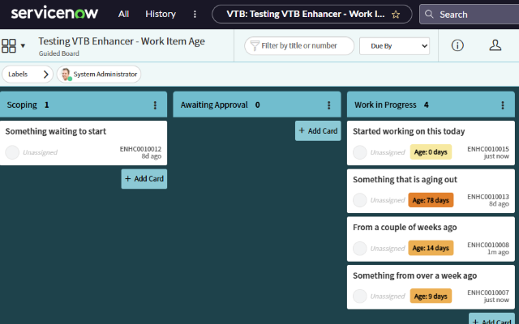
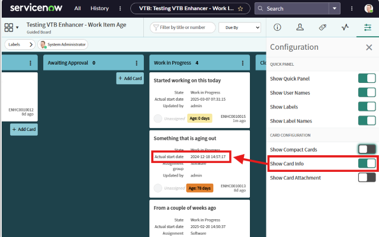

# ServiceNow Visual Task Board Enhancer - Work Item Age

## Overview

The **ServiceNow Visual Task Board Enhancer - Work Item Age** is a Microsoft Edge Extension designed to enhance Visual Task Boards (VTBs) in ServiceNow by displaying the Work Item Age in days. The Work Item Age is calculated as the difference between the **Actual Start Date** and the current date. This extension visually highlights task age with color-coded badges to improve task tracking and prioritization.

## Features

- Automatically identifies task cards on ServiceNow Visual Task Boards.
- Extracts the **Actual Start Date** field from each card.
- Calculates and displays the Work Item Age in a badge at the bottom of each card.
- Uses customizable color-coding to indicate urgency. Here are the defaults:
  - **< 7 days**: Light yellow (`#f9e79f`)
  - **7–30 days**: Moderate orange (`#f0ad4e`)
  - **30–90 days**: Strong orange (`#e67e22`)
  - **90+ days**: Red (`#d9534f`)
- Ensures contrast for readability.
- Runs efficiently, avoiding duplicate processing of the same cards.

## Requirements

For this extension to function correctly, your ServiceNow instance must meet the following conditions:

1. **The "Actual Start Date" field must be included in the VTB form view** for the task types you wish to track.
   - This requires configuring the form layout to include the **Actual Start Date** field in the "VTB" view (this view may need to be created if it does not already exist). The field does not need to be visible on the card by default; however, it must be part of the form view to ensure the data is available to the extension. 

2. **The "Actual Start Date" must be populated** by an external process.
   - There are some out of the box processes in ServiceNow that automatically set **Actual Start Date**. One example is when a task (enhancement, story, etc.) move into a Work in Progress state. You must ensure that this field is populated through state changes, workflows, business rules, automation scripts (like with Flow Designer), or manual entry.

## Installation

### From Edge Add-ons Store (Recommended)
1. Visit the [Microsoft Edge Add-ons Store](https://microsoftedge.microsoft.com/addons/detail/servicenow-visual-task-bo/jmhhlihdkbdeemfdmehanpkbfkkahpdd).
2. Click **Get** and follow the on-screen instructions.

### Manual Installation (Development Mode)
1. Download or clone this repository to a folder on your computer.
2. Open Microsoft Edge and navigate to `edge://extensions/`.
3. Enable **Developer Mode** (toggle in the bottom left).
4. Click **Load unpacked** and select the folder containing the extension files.
5. The extension should now be active.

## Usage

1. Navigate to your **ServiceNow Visual Task Board** (it must have `vtb.do` somewhere in the URL to run).
2. Open any board where task cards include the **Actual Start Date** in their form view.
3. If the extension is working, each card will display an "Age" badge at the bottom.
4. The badge will be color-coded based on task age.

## Customization

You can customize the color coding of the Work Item Age, both the number of days and the color, by using the Extension Options:

1. Click the extension icon in the Edge toolbar and select **Extension Options**.
2. Adjust the age bands and colors as desired.
3. Save your changes.

## Troubleshooting

### 1. No Work Item Age is Displayed
- Ensure that the **Actual Start Date** field is included in the VTB form view for the relevant task types.
- Confirm that the **Actual Start Date** is populated.
- Refresh the page or reload the extension.

### 2. Incorrect or Unexpected Values
- Verify that the **Actual Start Date** is correctly formatted and valid.
- Check if any ServiceNow customizations or security restrictions are preventing access to card data.

### 3. Extension Does Not Load
- Ensure the extension is **enabled** in `edge://extensions/`.
- Check the console (`F12` → Console) for errors.
- If running manually, re-load the unpacked extension.

## Contribution

Pull requests and contributions are welcome! If you encounter any issues or have suggestions for improvements, feel free to submit an issue.

## License

This project is licensed under the GNU General Public License v3.0. See the [LICENSE](LICENSE) file for details.
